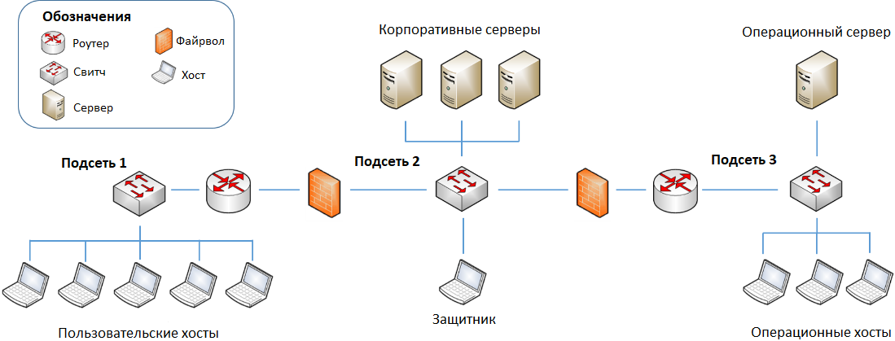
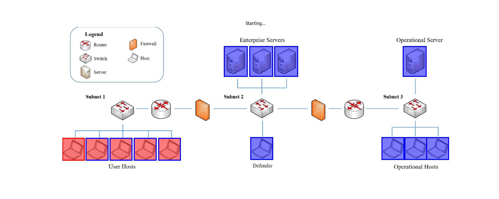

# Установка 
Запуск кода происходил на версии python 3.8.10 

Установка выполняется по инструкции в https://github.com/cage-challenge/cage-challenge-1
# Использование алгоритма DDQN в среде TTCP CAGE 1
## Описание среды

На рисунке выше показана инфраструктура среды TTCP CAGE 1, включающая три подсети, где взаимодействуют три типа агентов: красный, синий и зелёный.

Первая подсеть включает пять пользовательских хостов, на каждом из которых размещён зеленый агент. Эти зелёные агенты моделируют типичное поведение пользователей, создавая регулярный сетевой трафик и выполняя стандартные действия. В некоторых случаях зелёные агенты также имитируют аномальные события – например, случайные задержки или неожиданные действия, что помогает синему агенту отрабатывать навыки обнаружения аномалий и ложных тревог. Красный агент (злоумышленник) также находится в первой подсети и использует скомпрометированный хост для проведения атак, что требует от синего агента умение отличать настоящие угрозы от случайных аномалий.

Вторая подсеть содержит три корпоративных сервера и хост защитника, на которых синий агент выполняет свои основные защитные функции. Если хост защитника окажется взломанным, то синий агент теряет возможность воздействовать на узлы сети до тех пор, пока не восстановит доступ к хосту защитника.

Третья подсеть включает операционный сервер и вспомогательные хосты, которые обеспечивают синего агента дополнительной информацией о состоянии сети. Вывод из строя операционного сервера замедляет действия защитника, а вывод из строя вспомогательных хостов создаёт меньший замедляющий эффект, который суммируется в зависимости от количество отключенных хостов

Среда завершает эпизод за 100 действий синего агента

Таким образом, инфраструктура сети среды TTCP CAGE 1 имитирует реальные условия защиты сети, создавая ситуации, в которых разрушение ключевых узлов значительно влияют на способность синего эффективно реагировать на угрозы и поддерживать стабильность сети.
## Описание агентов

### Зеленый агент

Зеленый агент – это обычный пользователь в сети, который имеет пользовательские права на хосте. У него есть только два действия: работать в нормальном режиме и спровоцировать аномалию на хосте.

### Красный агент

Красный агент играет роль злоумышленника, чья основная цель – подорвать безопасность сети и нарушить её работоспособность. Он располагается на скомпрометированном пользовательском хосте в первой подсети и проводит атаки, направленные на ключевые узлы сети, такие как корпоративные серверы и хост защитника во второй подсети. Эти узлы представляют собой приоритетные цели для красного агента, поскольку их компрометация может привести к дестабилизации всей инфраструктуры и ограничению возможностей синего агента по защите сети

Поскольку действия красного агента сопровождаются аномалиями, вызванные зелеными агентами, в сетевом трафике, они требуют от синего агента постоянного мониторинга и анализа, чтобы отличать реальную угрозу от аномалий.
 
Действия красного агента удобней описать в виде таблицы.
 |Действия|Описание|Параметры|Последствия|
 |--------|--------|---------| ----------|
 |разведка подсети|получение IP адресов подсети|подсеть|красному агенту будут доступны все IP адреса хостов в подсети|
 |разведка сетевых сервисов|получение портов сервисов хоста|IP адрес хоста|красному агенту будут доступны порты и информация сервисов выбранного хоста|
 |эксплуатировать сетевой сервис|попытка получить доступ к хосту|IP адрес и порт хоста|в случае успеха красный агент получит пользовательские права доступа к хосту.|
 |повысить права доступа|повышение прав доступа|хост с пользовательскими правами доступа|В случае успеха красный агент получает root права к хосту|
 |уничтожить хост|выводит хост из сети|хост с root правами|В случае успеха хост в сети уничтожается|

 Теперь изобразим на схеме взаимодействия красного агента со средой
 
 
 ### Синий агент
Синий агент выполняет роль защитника сети, ответственного за мониторинг, выявление и нейтрализацию угроз, которые представляет красный агент. Работая на узле защитника, синий агент использует доступ к сети и её элементам для анализа сетевого трафика, отслеживания аномалий и реагирования на инциденты безопасности. Его задачи включают защиту корпоративных серверов и критически важных узлов от атак, предотвращение их компрометации и обеспечение стабильной работы инфраструктуры.

Синий агент опирается на поступающие данные с оперативного сервера и вспомогательных оперативных хостов, расположенных в третьей подсети. Эти узлы предоставляют информацию о состоянии сети и помогают агенту быстрее реагировать на потенциальные угрозы. Если оперативный сервер или вспомогательные хосты выходят из строя, скорость анализа сети и действия синего агента снижаются. При этом, если хост защитника подвергается атаке или отключению, синий агент теряет возможность контролировать и защищать остальные узлы сети.

Действия синего агента удобно описать в виде таблицы.
|Действия|Описание|Параметры|Последствия|
|--------|--------|---------| ----------|
|Мониторинг|Сбор информации всей сети, однако на сбор уходит больше времени чем на анализ конкретного узла сети|никаких|Синему агенту будет доступна информация всей сети на текущий момент, агент будет не доступен 3 хода|
|Анализ узла|Сбор информации конкретного узла в сети|IP адрес хоста|Синему агенту будет доступна информация конкретного узла в сети, агент будет не доступен 2 хода|
|Создать ложный порт или узел в сети|Создает ложный порт или узел в сети. Зеленый агент не имеет доступа к такому узлу или порту.|подсеть|В подсети будет доступен новый узел или порт.
Синий агент будет сразу осведомлен об активности красного агента на узле или порте|
|Закрыть уязвимость|Убирает уязвимость с порта|IP адрес и порт хоста|В случае успешного закрытия уязвимости красный агент теряет доступ к узлу, до тех пор, пока не найдет новую уязвимость|
|Восстановить узел |Сбрасывает состояние узла в сети до начального состояния|IP адрес хоста|При восстановлении узла в сети, права доступа у красного агента теряются, но не закрывается уязвимость|\

Теперь изобразим на схеме взаимодействия синего агента со средой

В самой среде, необходимо обучить синего агента реагировать на инциденты и противодействовать в уничтожении узлов в сети. Зеленый агент постоянно в зависимости от шансов может переходить только в 2 состояния. Красный агент принимает поведение, которое необходимо смоделировать для обучения противодействию атак. Например, в данной работе красный агент будет пытаться как можно быстрее добраться до корпоративных серверов и вывести их из строя. Поэтому введем функцию вознаграждения $R_a(s,s')$
функция вознаграждения будет суммировать штрафы за каждые пункты из таблицы:
|Хост|Действие|Штраф|
|----|--------|-----|
|пользовательский хост|root права у красного агента|-0.1|
|сервер|root права у красного агента|-1|
|сервер|уничтожение|-10|
|любой|синий агент восстанавливает узел|-1|

## Описание алгоритма DDQN
Сперва опишем архитектуру сети, по которой синий агент будет предсказывать действия

Теперь опишем цикл обучения агента DDQN

## Результаты обучения

## Тестирование агента

### Награда -163

### Награда -30.1

### Награда -26.2

### Награда -8.4

### Награда -5.3

